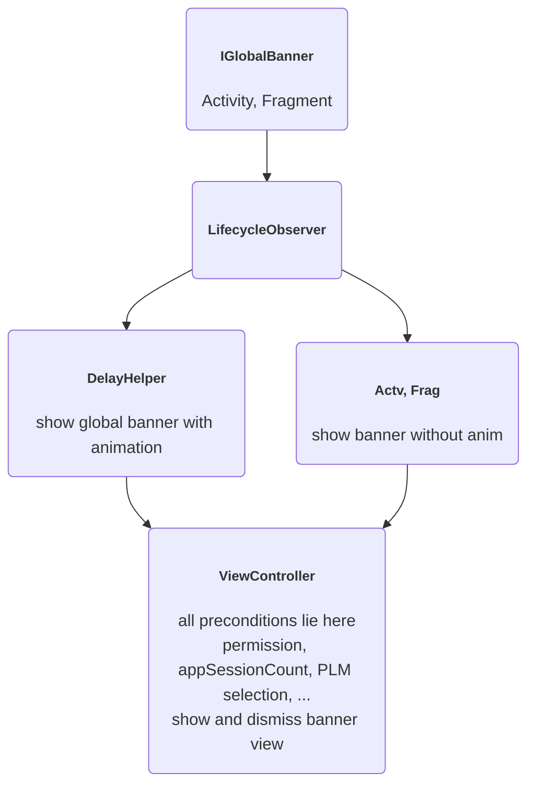

# How to use this package?
If you know which page is eligible to show the global banner, just go to that Activity or Fragment and set true to its `isGlobalBannerEnabled` property.
p.s. If you need to change the background color of the global banner, you can set the bg color as well.
```Kotlin
class HomeFragment{
     override val isGlobalBannerEnabled: Boolean = true
     // override val globalBannerBackgroundColor = Color.WHITE //optional
}
```

or Java:
```Java
    @Override
    public boolean isGlobalBannerEnabled() {
        return true;
    }

    // optional
/*
    @Override
    public int getGlobalBannerBackgroundColor() {
        return Color.parseColor("#138667");
    }
*/
```

That's it, that's all you need to do. When the time is right, the global banner will show.

# Classes

## LocationBannerViewController
This class will show or dismiss the global location banner.
All the preconditions lies in this class, such as : `isGlobalBannerAlreadyAdded`, `isGlobalBannerDismissedBefore`, `isNewSignUpUser`, `hasNoFullLocationPermission`.

## UpdateLocationPermissionBannerView
This class is the view of global location banner.
All the `setText`, `setOnClickListener` UI event lies in this class.

## IGlobalBanner, LocationBannerLifecycleObserver
These cases will show the global banner when necessary.
Use cases are complex, please see below.

## LocationBannerDelayHelper
The global location banner need to show with a 2 seconds delay. The use cases are complex, that's why this class was made.2



# Use cases
### Precondition
For the newly signup user, if you select "Not now" in the primary modal in the first app session after signup, then global banner will not show at all.
Global banner (update to Precis and All location permision) only shows after you select the "Yes please" in the primary modal.


### Use Case 1
1. open app,
2. time = 0s, reach the OfferList page (home page). Don't show the global banner
2. time = 2s, show the global banner with pushing down animation

### Use Case 2
1. open app,
2. time = 0s, reach the OfferList page (home page). Don't show the global banner
3. open a offer detail page quickly
4. time = 2s, show the global banner with pushing down animation in the detail page

p.s. The 2 seconds delay was a global concept.

### Use Case 3
1. open app,
2. time = 0s, reach the OfferList page (home page). Don't show the global banner
3. open the AllOffer page quickly
4. time = 2s, show the global banner with pushing down animation in the AllOffer page
4. open a OfferDetail page, which will show the global banner without animation

### Use Case 4
1. open app,
2. time = 0s, reach the OfferList page (home page). Don't show the global banner
3. time = 0.5s, open the Setting page quickly
4. time = 2s, no banner shows, since the Setting page is not eligible to show the global banner (it is in the blacklist)

### Use Case 5
1. open app,
2. time = 0s, reach the OfferList page (home page). Don't show the global banner
3. time = 0.5s, open the Setting page quickly (blacklist page)
4. time = 1.5s, go back to the home page (whitelist page)
5. time = 2.0s, still in the home page, but no banner shows, since the timeout is reset
5. time = 3.5s,  show the global banner with pushing down animation in the home page

p.s. going back to whitelist page from a blacklist page, then the 2 seconds timeout will be reset.


### Use Case 6
Animation only shows once per user session (open the app <--- one session ---> close the app)
so next time we reopen the app, the animation will show once again.


### Use Case 7
only when the location permission is not "Always" and "Precise", then it's eligible to show global banner.Java

### Use Case 8
1. open app. time = 2s, shows the global banner
2. go setting the location permission to "precise" AND "all the time",
3. go bck to our c51 app, all the global banners should dismiss, even you are at a whitelist page.

### Use Case 9
1. turn off the Internet connection, open the app
2. time = 2s, no global Banner shows. Because global banner shows only when online
3. time = 5s, turn on the Internet connection, still in the whitelist page
4. time = 7s, (since it's = 5s + 2s delay), the global banner will show with animation

### Use Case 10
1. sign up a new user, this could be counted as the first app session.
    In the first app session, the prime modal should show, and the old wizard should be removed
2. force close the app, reopen the c51 app. This is the second session
    In the second app session, the global banner is eligble to show.
Aka. no global banner shows in the first app session after signup


# More details about requirements

## whitelist pages
* Home Page,
* View All,
* Bonus Details,
* Offer Details,
* Search Page,
* Redeem Page,
* Extras Page (Any tab)

Other than these pages, the rest are all in the blacklist, which is not eligible to show the global banner.

# Ref
[C51SMRT-3281](https://nrs-it.atlassian.net/browse/C51SMRT-3281)